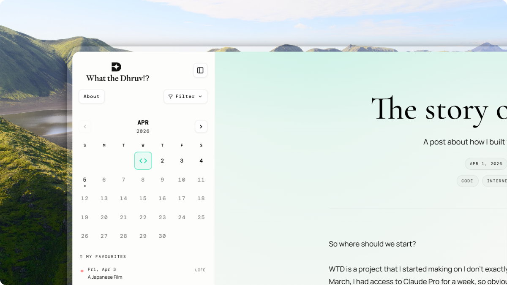

# What the Dhruv

<p align="center">
  <strong>A Space where thoughts find their way home</strong><br />
  <em>One Markdown file per day — calendar, topics, and likes that remember you.</em>
</p>


<p align="center">
  <a href="https://github.com/JDhruv14/wtd"><strong>Repository</strong></a>
  &nbsp;·&nbsp;
  <a href="content/WRITING.md"><strong>Writing guide</strong></a>
</p>

<p align="center">
  
</p>

## Why this exists

**What the Dhruv** is built around a simple idea: In all the hustle and fast paced life, we tend to forget all the small details, learnings and observations. This website is dedicated to you, I want you to talk to yourself, confront youself and spend some 5 minutes with your self.

**Built with:** Next.js 16 · TypeScript · React · Cloudflare · Redis

## Setup

```bash
git clone https://github.com/JDhruv14/wtd.git
cd wtd
npm install
```

`.env`:

```env
UPSTASH_REDIS_REST_URL=
UPSTASH_REDIS_REST_TOKEN=
```

```bash
npm run dev
```

## Writing posts

**[content/WRITING.md](content/WRITING.md)** — front matter, Markdown, embeds, `icon-name`, tags.

## Scripts

| Command | Purpose |
|--------|---------|
| `npm run dev` | Content index + Next dev |
| `npm run build` | Content index + OpenNext (Cloudflare) build |
| `npm run preview` | Preview Cloudflare build |


## Support

[](https://github.com/sponsors/JDhruv14)
[](https://buymeacoffee.com/jdhruv14)

## Creator

**[@dhruvtwt_](https://x.com/dhruvtwt_)**

---

<p align="center">
    
</p>

